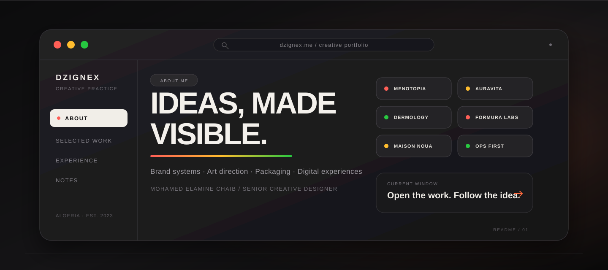

<div align="center">
  <a href="https://dzignex.me/">
    
  </a>

  <br>

  <strong>A creative portfolio built like a workspace: open a window, follow an idea, and explore the system.</strong>

  <br><br>

  <a href="https://dzignex.me/"></a>
  <a href="mailto:hello@dzignex.me"></a>
  <a href="https://www.behance.net/dzignex_"></a>

  <br><br>

  <a href="https://www.instagram.com/dzignex_">Instagram</a>&nbsp;&nbsp;·&nbsp;&nbsp;
  <a href="https://www.linkedin.com/in/dzignex/">LinkedIn</a>&nbsp;&nbsp;·&nbsp;&nbsp;
  <a href="mailto:hello@dzignex.me">hello@dzignex.me</a>
</div>

## 01 / About the designer

**Mohamed Elamine Chaib**, known as **Amine**, is an Algerian Senior Creative Designer and the Co-Founder / Creative Director of **Dzignex Studio**.

Amine works across identity, packaging, art direction, and digital design. Each project begins with the problem behind the brief. He defines the brand’s character, then builds a visual system that people can recognize in the real world.

> **DZIGNEX STUDIO** &nbsp;·&nbsp; Co-Founder / Creative Director &nbsp;·&nbsp; 2023 → Present<br>
> **INDEPENDENT PRACTICE** &nbsp;·&nbsp; Brand & Visual Designer &nbsp;·&nbsp; 2020 → 2023

## 02 / Creative practice

Four connected disciplines shape the practice:

<table>
  <tr>
    <td width="50%" valign="top">
      <h3>01 / Brand systems</h3>
      Distinctive identities built to stay coherent across every customer touchpoint.
    </td>
    <td width="50%" valign="top">
      <h3>02 / Art direction</h3>
      One clear visual idea translated into image, type, color, composition, and campaign language.
    </td>
  </tr>
  <tr>
    <td width="50%" valign="top">
      <h3>03 / Packaging</h3>
      Product experiences that balance shelf presence, recognition, and practical use.
    </td>
    <td width="50%" valign="top">
      <h3>04 / Digital experiences</h3>
      Interfaces and websites that let the brand behave with the same clarity as it looks.
    </td>
  </tr>
</table>

## 03 / Selected work

Six case studies show how each system adapts to a different market:

<table>
  <tr>
    <td width="50%" valign="top">
      <sub>01 / SKINCARE · PACKAGING</sub><br><br>
      <strong><a href="https://dzignex.me/works/menotopia">MENOTOPIA ↗</a></strong><br>
      Packaging for a French skincare brand, shaped around a distinctive product world.
    </td>
    <td width="50%" valign="top">
      <sub>02 / NUTRICOSMETICS · IDENTITY</sub><br><br>
      <strong><a href="https://dzignex.me/works/auravita">AURAVITA ↗</a></strong><br>
      Brand identity and packaging for a contemporary nutricosmetics brand.
    </td>
  </tr>
  <tr>
    <td width="50%" valign="top">
      <sub>03 / DERMATOLOGY · DIGITAL</sub><br><br>
      <strong><a href="https://dzignex.me/works/champ-dermology">DERMOLOGY ↗</a></strong><br>
      Identity, packaging, and website design for an Algerian skincare brand.
    </td>
    <td width="50%" valign="top">
      <sub>04 / SUPPLEMENTS · BRANDING</sub><br><br>
      <strong><a href="https://dzignex.me/works/formura-labs">FORMURA LABS ↗</a></strong><br>
      A brand system for an Algerian supplement manufacturer.
    </td>
  </tr>
  <tr>
    <td width="50%" valign="top">
      <sub>05 / FRAGRANCE · PACKAGING</sub><br><br>
      <strong><a href="https://dzignex.me/works/noua">MAISON NOUA ↗</a></strong><br>
      Identity refresh and packaging for an Algerian fragrance house.
    </td>
    <td width="50%" valign="top">
      <sub>06 / CONSULTING · EXPERIENCE</sub><br><br>
      <strong><a href="https://dzignex.me/works/ops-first">OPS FIRST ↗</a></strong><br>
      A focused brand experience for an operations consultancy.
    </td>
  </tr>
</table>

## 04 / Built as an interface

The portfolio uses a desktop interaction model instead of a conventional gallery. Projects open as windows, while About and Notes become working surfaces. Visitors explore Amine’s practice through the same interface language that defines the website.

- macOS-inspired windows and controls
- Dedicated, long-form case studies
- Responsive behavior across desktop and mobile
- About, experience, and Notes surfaces
- Direct contact and social paths
- Locally served portfolio imagery for consistent presentation

## 05 / Under the interface

The experience uses a focused static stack:

<div align="center">
  
  
  
  
  
</div>

The repository is a static portfolio made with HTML, CSS, JavaScript, and locally stored Framer assets. It is deployed through Netlify and intentionally has **no package installation and no build step**.

## 06 / Open it locally

With [Node.js](https://nodejs.org/) installed, run the included static server from the repository root:

```bash
node tools/static-server.mjs . 3200
```

Then open [`http://127.0.0.1:3200`](http://127.0.0.1:3200).

## 07 / Repository map

The repository separates case studies, interface behavior, and local assets:

```text
.
├── index.html                  Main interactive portfolio
├── works/                     Six individual case studies
├── framerusercontent.com/     Local typography, media, and runtime assets
├── mac-window-controls.*      Window movement, sizing, and controls
├── mobile-project-images.js   Mobile project presentation
├── notes-content-sync.js      Responsive experience and Notes content
├── about-email-link.js        Direct contact interaction
├── tools/                     Local preview and verification utilities
└── _headers                   Netlify response headers
```

<div align="center">
  <h3>Build a clearer idea for your brand.</h3>
  <p>Brand identity · Art direction · Packaging · Digital design</p>
  <a href="mailto:hello@dzignex.me"><strong>START A CONVERSATION →</strong></a>
  <br><br>
  Designed by <strong>Mohamed Elamine Chaib</strong> · Built as <strong>Dzignex</strong>
</div>
